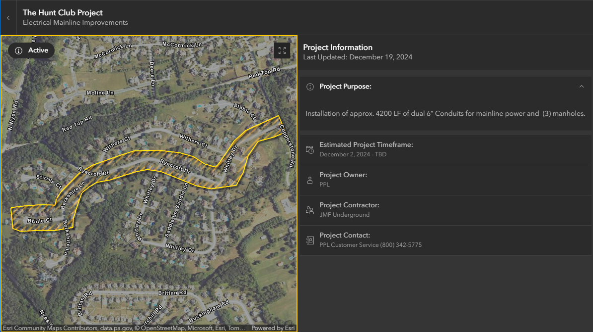

# Construction & Detours App
## Lower Paxton Township | Public Works Department
#### All Code Developed by Ben Beattie (GIS Analyst Intern) Spring 2025



<br>
The tech stack used for this is VueJS with ArcGIS Maps SDK For JavaScript & the Calcite Design System.
<br>
<br>

To install dependencies and start the development server, then run:

```sh
npm install
npm run dev
```

To commit changes to live website, run:

```sh
git add .
git commit -m "commit message text"
git push origin main
```
